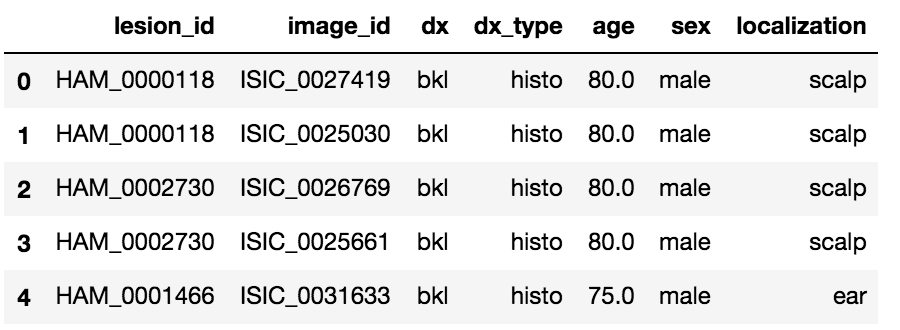
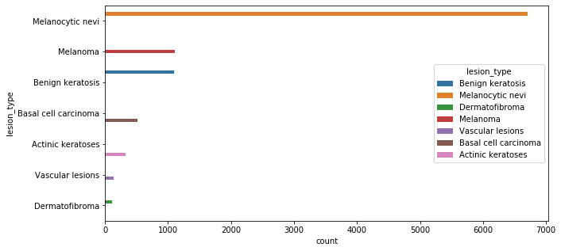
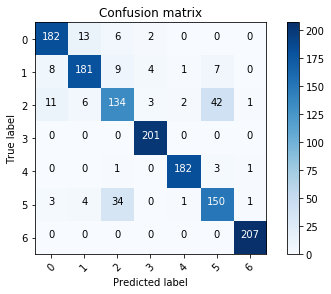

# Skin Cancer Detection
### What is this all about?
The aim of this project is to detect **skin lesions** using a deep learning CNN model with Keras. This project is a part of the ongoing **Advanced Machine Learning**.

### Introduction
Any type of cancer is somehow deeply dangerous if not deadly. To see how bad the situation is, let us look at some of the stats given by the [skin cancer organization](https://www.skincancer.org/skin-cancer-information/):
* One in five Americans will develop skin cancer by the age of 70
* Actinic keratosis is the most common precancer; it affects more than 58 million Americans
* The annual cost of treating skin cancers in the U.S. is estimated at $8.1 billion: about $4.8 billion for nonmelanoma skin cancers and $3.3 billion for melanoma.
* Skin cancer represents approximately 2 to 4 percent of all cancers in Asians
* Skin cancer represents 4 to 5 percent of all cancers in Hispanics
* Skin cancer represents 1 to 2 percent of all cancers in blacks

### Problem
Analyzing cancers isn't an easy task. It requires intensive examining. More than 50% of lesions are confirmed through histopathology (histo), the ground truth for the rest of the cases is either follow-up examination (follow_up), expert consensus (consensus), or confirmation by in-vivo confocal microscopy (confocal). The lack of experts(radiologists) has always been a bottleneck. Now there are three things that we have to consider here:
* Given the fact that there are a limited number of experts, how can we make them more efficient? Can we aid them using state of the art machine learning techniques? If yes, how?
* Training of neural networks for automated diagnosis of pigmented skin lesions is hampered by the small size and lack of diversity of available dataset of dermatoscopic images. Labelled data in healthcare is another bottleneck. With the available limited data, how much can we do?

As Machine Learning Engineers, if we can't help the doctors and ultimately the society, then what are we good at? Healthcare is a complicated field and using Machine Learning in this field has its own *advantages* and *disadvantages*. There is a limit to which we can do things with ML in healthcare but whatever we can do, it matters!

### Dataset
The dataset is a part of [Kaggle Datasets](https://www.kaggle.com/kmader/skin-cancer-mnist-ham10000). A big thank you to **Kevin Mader** for uploading this dataset to kaggle.
The dataset comprises of a total of **10,000** images stored in two folders. The information about the data is stored in a dataframe which looks like this:

<figure>
  
  <figcaption></figcaption>
</figure>

There are a total of **7 classes** of skin cancer in the dataset. After removing the duplicates we were left with around **~8K samples**. Checking the final distribution as shown below, we found out that the dataset is **highly imbalanced** which poses another challenge. For detailed notes, please check the **EDA notebook** in the notebooks directory

<figure>
  
  <figcaption></figcaption>
</figure>

## Reports

**Final validation loss**: 0.7610  
**Final testing loss**:   0.7017 

**Final validation accuracy**: 0.895  
**Final testing accuracy**:   0.884 

**Final validation precision**: 0.895  
**Final testing precision**:   0.876 

**Final validation recall**: 0.902  
**Final testing recall**:   0.892 

**Final validation F1 score**: 0.898  
**Final testing F1 score**:   0.884 

**Confusion matrix**  

**Classification Report**

                precision    recall  f1-score   support

       akiec       0.89      0.90      0.895        203
         bcc       0.89      0.86      0.875        210
         bkl       0.73      0.67      0.699        199
          df       0.96      1.00      0.980        201
         mel       0.98      0.97      0.975        187
          nv       0.74      0.78      0.759        193
        vasc       0.99      1.00      0.995        207

    
